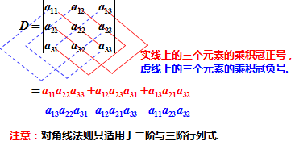

# 线性代数计算题相关


参考：[《线性代数》4小时速成课（不挂科） | 框框老师](https://www.bilibili.com/video/BV1Ey4y147xn/?share_source=copy_web&vd_source=aeb4f89b7c74bd892c2a834774309409)

在线矩阵计算：https://m.matrix.reshish.com/zh/

在线编写数学公式：https://www.latexlive.com/

```latex
`&` %列对齐
`\\` %换行
`\ ` %小空格
`\vdot` %点乘
`\cdots` %水平省略号
`\vdots` %垂直省略号
`\hline` %水平线
`\overset{above}{\underset{below}{=}}` %等号上下写东西
\overset{}{\rightarrow} %右箭头→
\begin{split} \end{split} %如果有多行，需要在这个框架里写
\begin{vmatrix} \end{vmatrix} %行列式
\left( \begin{array}{ccc|cc} \end{array} \right) %矩阵，在第三列后面画竖线分割
```

latex没有的用unicode编码代替


嘟嘟嘟～嘟嘟嘟～  

Work work work work

Work work work work

Work work work work

勤劳又勇敢～的Eyja6～ 

为了大家的线性代数

他做出了巨大的贡献 

巨大的牺牲 

巨大的carry 

无敌了～无敌了～———


## 1. 行列式计算


行列式性质：

1. 行列式的倍加性质：行列式的某行或某列的k倍加到另一行或列，行列式的值不变
2. 行列式的某行或某列的所有元素的公因子可提到行列式外面。
3. 交换行列式的两行(r)或列(c)，行列式的值变号
4. 行列式与它的转置行列式相等
5. 行列式中如果有两行（列）元素成比例，则此行列式为零．
6. 若行列式的某一列（行）的元素都是两数之和，则等于对应的两个行列式之和

$$
\begin{vmatrix}
  1 & 2+4& 3 \\ 
  4 & 5+7& 6 \\
  7 & 8+9& 9 \\
\end{vmatrix}=
\begin{vmatrix}
  1 & 2& 3 \\ 
  4 & 5& 6 \\
  7 & 8& 9 \\
\end{vmatrix}+
\begin{vmatrix}
  1 & 4& 3 \\ 
  4 & 7& 6 \\
  7 & 9& 9 \\
\end{vmatrix}
$$

7. $|A+B|\neq |A|+|B|$


### 1. 二阶行列式

$$
\begin{vmatrix}
  a11 & a12 \\ 
  a21 & a22 \\
\end{vmatrix}=a_{11}a_{22}-a_{12}a_{21}
$$

### 2. 三阶行列式

$$
\begin{vmatrix}
  1 & 2& 3 \\ 
  4 & 5& 6 \\
  7 & 8& 9 \\
\end{vmatrix}=1*5*9+2*6*7+4*8*3-3*5*7-2*4*9-1*6*8=0
$$




$$
D=\begin{vmatrix}
  a_{11} & & &  \\ 
    &a_{22}& &  \\
    & & \ddots&\\
    & & & a_{nn} \\
\end{vmatrix}=a_{11}a_{22} \cdots a_{nn}
$$


$$
D=\begin{vmatrix}
   & & & a_{1n} \\ 
    && a_{2,n-1}&  \\
    & ⋰& &\\
    a_{n1}& & &  \\
\end{vmatrix}=
(-1)^{\frac{n(n-1)}{2}}
a_{1n}a_{2,n-1} \cdots a_{n1}
$$


例1.

如下，可以构造上三角式，主对角线上元素依次相乘再乘以系数
$$
\begin{split}

&
\begin{vmatrix}
  1 & 2& -4 \\ 
  -2 & 2& 1 \\
  -3 & 4& 2 \\
\end{vmatrix} 
\stackrel{r_{2}+2r_{1}}{=}
\begin{vmatrix}
  1 & 2 & -4 \\ 
  0 & 6 & -7 \\
  -3 & 4 & 2 \\
\end{vmatrix}
\stackrel{r_{3}+3r_{1}}{=}
\begin{vmatrix}
  1 & 2 & -4 \\ 
  0 & 6 & -7 \\
  0 & 10 & -10 \\
\end{vmatrix}

\\ \\ &
\overset{第三行}{\underset{提因子}{=}} 
10\begin{vmatrix}
  1 & 2 & -4 \\ 
  0 & 6 & -7 \\
  0 & 1 & -1 \\
\end{vmatrix}

\overset{r_{2} \leftrightarrow r_{3}}{=}
-10\begin{vmatrix}
  1 & 2 & -4 \\ 
  0 & 1 & -1 \\
  0 & 6 & -7 \\
\end{vmatrix}

\overset{r_{3}-6r_{2}}{=}
-10\begin{vmatrix}
  1 & 2 & -4 \\ 
  0 & 1 & -1 \\
  0 & 0 & -1 \\
\end{vmatrix}
\\ \\ &
=-10*1*1*(-1)=10

\end{split}
$$


### 3. 范德蒙德行列式


$$
\begin{split}
&
D_{n}=
\begin{vmatrix}  
  1 & 1& \cdots & 1 \\  
  x_{1}&x_{2}  & \cdots &x_{n}\\ 
  \vdots &\vdots &&\vdots \\
  x_{1}^{n-1} & x_{2}^{n-1} &\cdots& x_{n}^{n-1} 
\end{vmatrix}=
\prod \limits_{1 \leq j < i \leq n} (x_{i}-x_{j})

\\ &
=(x_{n}-x_{n-1})(x_{n}-x_{n-2}) \cdots (x_{n}-x_{1}) \\ &
(x_{n-1}-x_{n-2})(x_{n-1}-x_{n-3}) \cdots (x_{n-1}-x_{1}) \\ &\cdots
(x_{3}-x_{2})(x_{3}-x_{1})(x_{2}-x_{1})

\end{split}
$$


特点：1. 第一行或列元素全为1.

2. 第一列或行元素均为等比数列，且公比元素在第二行或列。
3. 其结果为：公比元素作差再相乘。


可通过构造下三角式证明。


### 4. 逆序数

排列：由1，2，...，n组成的一个有序数组叫n级排列

如：123 132 213 231 312 321为3级排列。3145不是排列，因为没有2，排列的中间不能缺数。

n级排列：n(n-1)…3×2×1=n!

逆序：大数排在小数前面，

逆序数：逆序的总数

数逆序数：

①从第一个开始，数后面有几个比它小的。

②切记顺序不能乱来。


如：N(4213)=3+1=4.（**4后面三个比它小，2后面一个比它小**）

如果逆序数是偶数叫偶排列；如果逆序数是奇数叫奇排列。


例1.   N(123...n)=0 称为标准排列（或自然排列）

例2.   $N(n(n-1)\cdots321)=n-1+n-2+\cdots+2+1=\frac{n(n-1)}{2}$


例3.   N(54123)=4+3+0+0=7


对换：交换一个排列中的两个数.

如：将例3中的12进行交换，N(54213)=4+3+1+0=8

我们发现将一个奇排列做一次对换会变成偶排列，同理原来是偶排列做一次对换

会变成奇排列.因此做一次对换，奇偶性改变；做偶数次对换，奇偶性不变.

定理：在n级排列中，奇排列和偶排列各占$\frac{n!}{2}$


### 5. 余子式与代数余子式

余子式：设$D=
\begin{vmatrix}
 a_{11} & a_{12} & a_{13} \\ 
 a_{21} & a_{22} & a_{23} \\
 a_{31} & a_{32} & a_{33} \\
\end{vmatrix}$，则元素$a_{ij}$的余子式为去掉$a_{ij}$所在的行与列所得到的行列式，记为$M_{ij}$

如：$M_{12}=\begin{vmatrix}
 a_{21}  & a_{23} \\
 a_{31}  & a_{33} \\
\end{vmatrix}$，$M_{33}=\begin{vmatrix}
 a_{11}  & a_{12} \\
 a_{21}  & a_{22} \\
\end{vmatrix}$


代数余子式：称$(-1)^{i+j}\cdot M_{ij}$为$a_{ij}$的代数余子式，记为$A_{ij}$

即：$A_{ij}=(-1)^{i+j}M_{ij}$


**行列式的展开定理**

行列式=某行(或列)元素乘以相应的代数余子式再求和
$$
D=
\begin{vmatrix}
 a_{11} & a_{12} & a_{13} \\ 
 a_{21} & a_{22} & a_{23} \\
 a_{31} & a_{32} & a_{33} \\
\end{vmatrix}=a_{i1}A_{i1}+a_{i2}A_{i2}+a_{i3}A_{i3},i=1,2,3
$$

$$
D=
\begin{vmatrix}
 a_{11} & a_{12} & a_{13} \\ 
 a_{21} & a_{22} & a_{23} \\
 a_{31} & a_{32} & a_{33} \\
\end{vmatrix}=a_{1j}A_{1j}+a_{2j}A_{2j}+a_{3j}A_{3j},j=1,2,3
$$

例：设$D=
\begin{vmatrix}
  3&  1&  -1&2 \\
  -5&  1&  3&-4 \\
  2&  0&1  &-1 \\
  1&  -5&3  &-3
\end{vmatrix}$，求$A_{31}+3A_{32}-2A_{33}+2A_{34}$

解：使用替换法构造如下矩阵并求解
$$
\begin{split} 
&
A_{31}+3A_{32}-2A_{33}+2A_{34}=
\begin{vmatrix}
  3&  1&  -1&2 \\
  -5&  1&  3&-4 \\
  1&  3&-2  &2 \\
  1&  -5&3  &-3
\end{vmatrix}
\overset{r_{3}+\frac{2}{3}r_{4}}{=}
\\ &
\begin{vmatrix}
  3&  1&  -1&2 \\
  -5&  1&  3&-4 \\
  \frac{5}{3}&  -\frac{1}{3}&0  &0 \\
  1&  -5& 3  &-3
\end{vmatrix}
=\frac{5}{3}A_{31}+-\frac{1}{3}A_{32}
=\frac{5}{3}(-1)^{4}M_{31}+-\frac{1}{3}(-1)^{5}M_{32}
\\ &
=\frac{5}{3}\begin{vmatrix}
    1&  -1&2 \\
    1&  3&-4 \\
    -5&3  &-3
\end{vmatrix}+\frac{1}{3}\begin{vmatrix}
  3&   -1&2 \\
  -5&  3&-4 \\
  1&  3  &-3
\end{vmatrix}
=\frac{80}{3}-\frac{8}{3}=24
\end{split}
$$


### 6. 拆和法计算行列式

例：若$D=
\begin{vmatrix}
 a_{11} & a_{12} & a_{13} \\ 
 a_{21} & a_{22} & a_{23} \\
 a_{31} & a_{32} & a_{33} \\
\end{vmatrix}=1$，$D_{1}=
\begin{vmatrix}
 -2a_{11} & 2a_{11}-a_{12} & a_{13} \\ 
 -2a_{21} & 2a_{21}-a_{22} & a_{23} \\
 -2a_{31} & 2a_{31}-a_{32} & a_{33} \\
\end{vmatrix}$，则$D_{1}$=2。


解：根据前文提到的行列式性质5和6有
$$
\begin{split} &
D_{1}=
\begin{vmatrix}
 -2a_{11} & 2a_{11}-a_{12} & a_{13} \\ 
 -2a_{21} & 2a_{21}-a_{22} & a_{23} \\
 -2a_{31} & 2a_{31}-a_{32} & a_{33} \\
\end{vmatrix}=
\begin{vmatrix}
 -2a_{11} & 2a_{11} & a_{13} \\ 
 -2a_{21} & 2a_{21} & a_{23} \\
 -2a_{31} & 2a_{31} & a_{33} \\
\end{vmatrix}+
\begin{vmatrix}
 -2a_{11} & -a_{12} & a_{13} \\ 
 -2a_{21} & -a_{22} & a_{23} \\
 -2a_{31} & -a_{32} & a_{33} \\
\end{vmatrix}
\\ &
=(-2)(-1)\begin{vmatrix}
 a_{11} & a_{12} & a_{13} \\ 
 a_{21} & a_{22} & a_{23} \\
 a_{31} & a_{32} & a_{33} \\
\end{vmatrix}=2
\end{split}
$$


### 7. 拉普拉斯公式计算行列式


$$
D=
\begin{vmatrix}
 a_{1} & a_{2} & 0&0\\ 
 a_{3} & a_{4} & 0&0 \\
 c_{1} & c_{2} & b_{1} &b_{2} \\
 c_{3} &c_{4} &b_{3} &b_{4}
\end{vmatrix}=
\begin{vmatrix}
 a_{1} & a_{2} \\ 
 a_{3} & a_{4}
\end{vmatrix}
\vdot 
\begin{vmatrix}
    b_{1} &b_{2} \\
    b_{3} &b_{4}
\end{vmatrix}
$$


例：
$$
D=
\begin{vmatrix}
 5 & 2 & 0&0\\ 
 2 & 1 & 0&0 \\
 1 & 2 & 8 &3 \\
 0 & 3 &5 &2
\end{vmatrix}=
\begin{vmatrix}
 5 & 2 \\ 
 2 & 1
\end{vmatrix}
\vdot 
\begin{vmatrix}
    8 &3 \\
    5 &2
\end{vmatrix}=1
$$


## 2. 矩阵计算


### 0. 概念速览

二阶单位矩阵 $E_{2}=I_{2}=\begin{pmatrix}  
  1 & 0 \\  
  0 & 1 
\end{pmatrix}$


$A^{-1}$称为A的逆矩阵，写出增广矩阵并进行变换得到。$(A|E) \rightarrow (E|A^{-1})$

**行列式|A| 不为0，则A可逆。**

> 逆矩阵的性质：1. 如果A可逆，那么A的逆矩阵是唯一的
>
> 2. 单位矩阵E是可逆的，零矩阵是不可逆的
>
> 3. 若A可逆，则$A^{-1}$可逆，并且$(A^{-1})^{-1}=A$，$(A^{T})^{-1}=(A^{-1})^{T}$
>
> 4. 若A，B为同阶方阵且均可逆，则AB亦可逆,且$(AB)^{-1}=B^{-1} A^{-1} $
>
> 5. n阶方阵A可逆的充分必要条件是r(A)=n。
>
>    对n阶方阵A，若r(A)=n，则称A为满秩矩阵或非奇异矩阵。
>
> 6. 任何一个满秩矩阵都能通过有限次初等行变换化为单位矩阵
>
>    推论：满秩矩阵A的逆矩阵可以表示成有限个初等矩阵的乘积
>
> 7. 对于方阵A有 $|A^{-1}|=\frac{1}{|A|}$，$|kA_{n\times n}|=k^{n}|A|$
>
> 8. 若$k\neq 0$，$(kA)^{-1}=\frac{1}{k}A^{-1}$


$A^{*}$称为A的伴随矩阵，且$AA^{*}=A^{*}A=|A|\vdot E$，$A^{*}=|A|\vdot A^{-1}$

> 伴随矩阵性质：**下面式子中出现的矩阵均为至少2阶的方阵。**
>
> 1. 对于任意方阵A，其伴随矩阵一定存在。
>
> 2. $(AB)^{*}=B^{*} A^{*}$
>
> 3. $ |A^{*}|= |A|^{n-1}$
>
> 4. 对于常数k，$(kA)^{*}=k^{n-1}A^{*}$
>
> 5. $(A^{T})^{*}=(A^{*})^{T}$
>
> 6. $$
>    分块阵C=
>    \begin{pmatrix}
>      A& \\
>      &B
>    \end{pmatrix}的伴随矩阵为C^{*}=\begin{pmatrix}
>      |B|A^{*}& \\
>      &|A|B^{*}
>    \end{pmatrix};\\
>    分块阵D=
>    \begin{pmatrix}
>      &A \\
>      B&
>    \end{pmatrix}的伴随矩阵为
>    D^{*}=\begin{pmatrix}
>      &|A|B^{*} \\
>      |B|A^{*}&
>    \end{pmatrix}m和n分别是A和B的阶数）。
>    $$
>
>    
>
>    **下面式子中出现的矩阵均为n （n>=2）阶可逆方阵。**
>    
> 7. $(A^{*})^{*}=|A|^{n-2}A$
>
> 8. 方阵可逆 等价于 其行列式值非零 等价于 其伴随矩阵可逆；
>
> 9. $(A^{-1})^{*}=(A^{*})^{-1}$


$A^{T}$称为A的转置矩阵，由A中的行列互换（行标列标互换）得到

> 转置矩阵性质：1. $(A^{T})^{T}=A$
>
> 2. $(A+B)^{T}=A^{T}+B^{T}$
> 3. $(kA)^{T}=kA^{T}$
> 4. $(AB)^{T}=B^{T}A^{T}$
> 5. $|A^{T}|=|A|$


若$A^{T}=A$，则A称为对称矩阵

若$A^{T}=-A$，则A称为反对称矩阵

对角矩阵$\Lambda$，主对角线之外的元素皆为0，主对角线上的元素可以为0或其他值。


**正交矩阵Q**

$AA^{T}=E$（E为单位矩阵，$A^{T}$表示“矩阵A的转置矩阵”。）或$AA^{T}=E$，则n阶实矩阵A称为正交矩阵，若A为正交阵，则满足以下条件：

1. $A^{T}=A^{-1}$
2.  |A|=1或-1
3. $A^{T}$是正交矩阵
4. $A^{T}$的各行是单位向量且两两正交
5. $A^{T}$的各列是单位向量且两两正交(内积为0，比如$(\alpha_{1},\alpha_{2})=\alpha_{1}^{T}\alpha_{2}=(1,0)\begin{pmatrix}0\\1\end{pmatrix}=0$)
7. (Ax,Ay)=(x,y)x,y∈R


**初等行变换**

定义：所谓数域P上矩阵的初等行变换是指下列3种变换：

1）以P中一个非零的数乘矩阵的某一行

2）把矩阵的某一行的c倍加到另一行，这里c是P中的任意一个数

3）互换矩阵中两行的位置

一般来说，一个矩阵经过初等行变换后就变成了另一个矩阵，当矩阵A经过初等行变换变成矩阵B时，一般写作$A\rightarrow B$

可以证明：任意一个矩阵经过一系列初等行变换总能变成阶梯型矩阵。


**初等列变换**

同样地，定义初等列变换，即：

1）以P中一个非零的数乘矩阵的某一列

2）把矩阵的某一列的c倍加到另一列，这里c是P中的任意一个数

3）互换矩阵中两列的位置 


### 1. 矩阵加法


$$
\begin{pmatrix}
 a_{11} & a_{12} & a_{13} \\ 
 a_{21} & a_{22} & a_{23} \\
 a_{31} & a_{32} & a_{33} \\
\end{pmatrix}+
\begin{pmatrix}
 a_{11} & b_{12} & a_{13} \\ 
 a_{21} & b_{22} & a_{23} \\
 a_{31} & b_{32} & a_{33} \\
\end{pmatrix}=
\begin{pmatrix}
 a_{11}+a_{11} & a_{12}+b_{12} & a_{13}+a_{13} \\ 
 a_{21}+a_{21} & a_{22}+b_{22} & a_{23}+a_{23} \\
 a_{31}+a_{31} & a_{32}+b_{32} & a_{33}+a_{33} \\
\end{pmatrix}
$$


**矩阵与行列式数乘比较**
$$
\begin{split}
&\begin{vmatrix}
  a_{1}&b_{1} \\
  c_{1}&d_{1}
\end{vmatrix}+
\begin{vmatrix}
  a_{1}&b_{2} \\
  c_{1}&d_{2}
\end{vmatrix}+
\begin{vmatrix}
  a_{2}&b_{1} \\
  c_{2}&d_{1}
\end{vmatrix}+
\begin{vmatrix}
  a_{2}&b_{2} \\
  c_{2}&d_{2}
\end{vmatrix}

\\ &
=\begin{vmatrix}
  a_{1}&b_{1}+b_{2} \\
  c_{1}&d_{1}+d_{2}
\end{vmatrix}+
\begin{vmatrix}
  a_{2}&b_{1}+b_{2} \\
  c_{2}&d_{1}+d_{2}
\end{vmatrix}

\\ &
=\begin{vmatrix}
  a_{1}+a_{2}&b_{1}+b_{2} \\
  c_{1}+c_{2}&d_{1}+d_{2}
\end{vmatrix}

\end{split}
$$


### 2. 矩阵乘积


$$
\begin{split}
&设A_{2 \times 2}=
\begin{pmatrix}  
  a & b \\  
  c & d  
\end{pmatrix} ,
B_{2 \times 3}=
\begin{pmatrix}  
  e & f & g \\  
  h & m & n 
\end{pmatrix}

\\ &
则A_{2 \times 2}\vdot B_{2 \times 3}=
\begin{pmatrix}  
  a & b \\  
  c & d  
\end{pmatrix}\vdot
\begin{pmatrix}  
  e & f & g \\  
  h & m & n 
\end{pmatrix}
=
\begin{pmatrix}  
  ae+bh & af+bm & ag+bn \\  
  ce+dh & cf+dm & cg+dn  
\end{pmatrix}
=C_{2 \times 3}

\end{split}
$$


矩阵相乘的合法性：内标相等。比如上面A的列标2与B的行标2相等，所以合法。

矩阵相乘的结果：前行后列。比如上面结果中一共有2行(A的行标)，3列(B的列标)。


矩阵乘法性质：

1. 矩阵乘法不具有交换律：$AB\neq BA$

2. 矩阵乘法满足分配律：A(B+C)=AB+AC

   如：AB+A=A(B+E)，其中E是一个单位矩阵


**矩阵与行列式数乘比较**

设$\lambda$是数字，有
$$
\lambda \begin{vmatrix}
 a_{11} & a_{12} & a_{13} \\ 
 a_{21} & a_{22} & a_{23} \\
 a_{31} & a_{32} & a_{33} \\
\end{vmatrix}=
\begin{vmatrix}
 \lambda a_{11} & \lambda a_{12} & \lambda a_{13} \\ 
 a_{21} & a_{22} & a_{23} \\
 a_{31} & a_{32} & a_{33} \\
\end{vmatrix}=
\begin{vmatrix}
 a_{11} & a_{12} & \lambda a_{13} \\ 
 a_{21} & a_{22} & \lambda a_{23} \\
 a_{31} & a_{32} & \lambda a_{33} \\
\end{vmatrix}
$$


$$
A\lambda =\lambda A=\lambda \begin{pmatrix}
 a_{11} & a_{12} & a_{13} \\ 
 a_{21} & a_{22} & a_{23} \\
 a_{31} & a_{32} & a_{33} \\
\end{pmatrix}=
\begin{pmatrix}
 \lambda a_{11} & \lambda a_{12} & \lambda a_{13} \\ 
 \lambda a_{21} & \lambda a_{22} & \lambda a_{23} \\
 \lambda a_{31} & \lambda a_{32} & \lambda a_{33} \\
\end{pmatrix}
$$


### 3. 抽象矩阵求逆

对于方阵A，B，若AB=E(或BA=E)，则称A，B互为逆矩阵，记为$A^{-1}=B，B^{-1}=A$

例：设方阵A(矩阵满足行数等于列数)满足$A^{2}-A-2E=0$，求$(A+2E)^{-1}$

法一：凑定义法`(A+2E) ? =E`
$$
\begin{split}
&A^2-A-2E \\
&=A^2+2A-3A-2E \\
&=A(A+2E)-3A-2E \\
&=A(A+2E)-3(A+2E)+4E \\
&=(A+2E)(A-3E)+4E \\
&=0 \\
&故(A+2E)(-\frac{1}{4})(A-3E)=E \\
&(A+2E)^{-1}=-\frac{1}{4}(A-3E) 
\end{split}
$$


法二：长除法

```
A^2-A-2E除以A+2E可以算得商A-3E余数4E
故(A+2E)(A-3E)+4E=0
同理可知(A+2E)^(-1)=-(1/4)(A-3E)
```


### 4. 数字型矩阵求逆

数字型矩阵求逆**不能**用初等列变换


例：求$A=\begin{pmatrix}
 3 & 2 & 1 \\ 
 3 & 1 & 5 \\
 3 & 2 & 3 \\
\end{pmatrix}$的逆矩阵$A^{-1}$

行列式不为零，所以矩阵的逆存在

写出增广矩阵并进行计算

$$
\begin{split} 
&
(A|E)=
\left(
\begin{array}{ccc|ccc}
    3 & 2 & 1 &1&0&0 \\
    3 & 1 & 5 &0&1&0\\
    3 & 2 & 3 &0&0&1\\ 
\end{array}
\right)

\overset{r_{2}-r_{1}}{\underset{r_{3}-r_{1}}{\rightarrow}}
\left(
\begin{array}{ccc|ccc}
    3 & 2 & 1 &1&0&0 \\
    0 & -1 & 4 &-1&1&0\\
    0 & 0 & 2 &-1&0&1\\ 
\end{array}
\right)

\overset{r_{1}+2r_{2}}{\underset{r_{2}\vdot(-1)}{\rightarrow}} 
\\ \\ &
\overset{r_{3}\vdot \frac{1}{2}}{\underset{r_{1}\vdot\frac{1}{3}}{\rightarrow}}

\left(
\begin{array}{ccc|ccc}
    1 & 0 & 3 &-\frac{1}{3}&\frac{2}{3}&0 \\
    0 & 1 & -4 &1&-1&0\\
    0 & 0 & 1 &-\frac{1}{2}&0&\frac{1}{2}\\ 
\end{array}
\right)

\overset{r_{1}-3r_{3}}{\underset{r_{2}+4r_{3}}{\rightarrow}}
\left(
\begin{array}{ccc|ccc}
    1 & 0 & 0 &\frac{7}{6}&\frac{2}{3}&-\frac{3}{2} \\
    0 & 1 & 0 &-1&-1&2\\
    0 & 0 & 1 &-\frac{1}{2}&0&\frac{1}{2}\\ 
\end{array}
\right)=(E|A^{-1})

\\ \\ & 所以 A^{-1}=\left(
\begin{array}{}
    \frac{7}{6}&\frac{2}{3}&-\frac{3}{2} \\
    -1&-1&2\\
    -\frac{1}{2}&0&\frac{1}{2}\\ 
\end{array}
\right)

\end{split}
$$


**二阶矩阵求逆秒杀法**：两调一除。主对角线调换，副对角线取反，除以行列式$|A|$


若$A=\begin{pmatrix}
a& b \\
c& d \\ \end{pmatrix}$,且$|A| \neq 0$，则$A^{-1}=\frac{1}{|A|}\begin{pmatrix}
d& -b \\
-c& a \\ \end{pmatrix}$


比如$A=\begin{pmatrix}
1& 4 \\
-1& 2\\ \end{pmatrix}$，则$A^{-1}=\frac{1}{6}\begin{pmatrix}
2& -4 \\
1& 1 \\ \end{pmatrix}=\begin{pmatrix}
\frac{1}{3}& \frac{-2}{3} \\
\frac{1}{6}& \frac{1}{6} \\ \end{pmatrix}$


### 5. 矩阵方程求解


$$
若A\vdot X=B 且A^{-1}存在 \Rightarrow  X=A^{-1}\vdot B \\
若X\vdot A=B 且A^{-1}存在 \Rightarrow  X=B\vdot A^{-1} \\
若A\vdot X\vdot B=C 且A^{-1}和B^{-1}存在 \Rightarrow  X=A^{-1} \vdot C \vdot B^{-1}
$$


例1：已知$X\vdot\begin{pmatrix}
 2 & 1 & -1 \\ 
 2 & 1 & 0 \\
 1 & -1 & 1 \\
\end{pmatrix}=\begin{pmatrix}
 1 & -1 & 3 \\ 
 4 & 3 & 2 \\
\end{pmatrix}$，求$X^{-1}$

解：设$A=\begin{pmatrix}
 2 & 1 & -1 \\ 
 2 & 1 & 0 \\
 1 & -1 & 1 \\
\end{pmatrix}$，则|A|=3$\neq$0，$A^{-1}$存在

初等行变换法求$A^{-1}$易得
$$
\begin{split} &
A^{-1}=\begin{pmatrix}
 \frac{1}{3} & 0 & \frac{1}{3} \\ 
 -\frac{2}{3} & 1 & -\frac{2}{3} \\
 -1 & 1 & 0 \\
\end{pmatrix}
\\ \\ &
X\vdot A=B \Rightarrow  X=B\vdot A^{-1}
\\ \\ &

X=B\vdot A^{-1}
=\begin{pmatrix}
 1 & -1 & 3 \\ 
 4 & 3 & 2 \\
\end{pmatrix}
\begin{pmatrix}
 \frac{1}{3} & 0 & \frac{1}{3} \\ 
 -\frac{2}{3} & 1 & -\frac{2}{3} \\
 -1 & 1 & 0 \\
\end{pmatrix}
=\begin{pmatrix}
 -2 & 2 & 1 \\ 
 -\frac{8}{3} & 5 & -\frac{2}{3} \\
\end{pmatrix}

\end{split}
$$


例2：设矩阵X满足$A^{*}\vdot X=A^{-1}B+2X$，其中$A=\begin{pmatrix}
  1&1  &-1 \\
  -1&1  &1 \\
  1&-1  &1
\end{pmatrix}$，B=$\begin{pmatrix}
  1  &1 \\
  1  &0 \\
  0  &0
\end{pmatrix}$，求矩阵X


解：行列式|A|=4 不为零，所以矩阵的逆存在

写出增广矩阵并进行计算有
$$
\begin{split}
&A^{-1}=\begin{pmatrix}
  \frac{1}{2}&0  &\frac{1}{2} \\
  \frac{1}{2}&\frac{1}{2}  &0 \\
  0&\frac{1}{2}  &\frac{1}{2}
\end{pmatrix}
\\ \\ &
A^{*}=|A|\vdot A^{-1}=\begin{pmatrix}
  2&0  &2 \\
  2&2  &0 \\
  0&2  &2
\end{pmatrix}

\\ \\ &
A^{−1}B=\begin{pmatrix}
	\frac{1}{2} &\frac{1}{2} \\
	1 &\frac{1}{2} \\
	\frac{1}{2} &0
\end{pmatrix}

\\ \\ &
(A^{*}-2E)\vdot X=A^{-1}B
\\ \\ &
\begin{pmatrix}
  0&0  &2 \\
  2&0  &0 \\
  0&2  &0
\end{pmatrix}X=
\begin{pmatrix}
	\frac{1}{2} &\frac{1}{2} \\
	1 &\frac{1}{2} \\
	\frac{1}{2} &0
\end{pmatrix}

\\ \\ &
((A^{*}-2E) |E)=
\left(
\begin{array}{ccc|ccc}
    0 & 0 & 2 &1&0&0 \\
    2 & 0 & 0 &0&1&0 \\
    0 & 2 & 0 &0&0&1 \\ 
\end{array}
\right)
\overset{\frac{1}{2}r_{1}}{\underset{\frac{1}{2}r_{2}}{\rightarrow}}
\overset{\frac{1}{2}r_{3}}{\underset{r_{1}\leftrightarrow r_{3}}{\rightarrow}} 
\overset{r_{1}\leftrightarrow r_{2}}{\rightarrow}

\left(
\begin{array}{ccc|ccc}
	1&0&0& 0&\frac{1}{2}&0  \\
	0&1&0& 0&0 &\frac{1}{2} \\
	0&0&1& \frac{1}{2} &0 &0
\end{array}
\right)

\\ &
(A^{*}-2E)^{-1}=
\left(
\begin{array}{}
	 0&\frac{1}{2}&0  \\
	 0&0 &\frac{1}{2} \\
	 \frac{1}{2} &0 &0
\end{array}
\right)

\\ \\ &
X=
\left(
\begin{array}{}
	 0&\frac{1}{2}&0  \\
	 0&0 &\frac{1}{2} \\
	 \frac{1}{2} &0 &0
\end{array}
\right)
\begin{pmatrix}
	\frac{1}{2} &\frac{1}{2} \\
	1 &\frac{1}{2} \\
	\frac{1}{2} &0
\end{pmatrix}
=\begin{pmatrix}
	\frac{1}{2} &\frac{1}{4} \\
	\frac{1}{4} &0 \\
	\frac{1}{4} &\frac{1}{4}
\end{pmatrix}

\end{split}
$$


### 6. 方阵的行列式

常用公式： $|A^{-1}|=\frac{1}{|A|}$，$|kA_{n\times n}|=k^{n}|A|$，$|A^{T}|=|A|$，$ |A^{*}|= |A|^{n-1}$

若$k\neq 0$，$(kA)^{-1}=\frac{1}{k}A^{-1}$

$|A+B|\neq |A|+|B|$


例：设$A_{3\times 3}$，$|A|=\frac{1}{2}$，求$|(3A)^{-1}-2A^{*}|$


解：
$$
|(3A)^{-1}-2A^{*}|
=|(3A)^{-1}-2(|A|A^{-1})|
=|\frac{1}{3}A^{-1}-A^{-1}|
\\=|-\frac{2}{3}A^{-1}|
=(-\frac{2}{3})^{3}|A^{-1}|=-\frac{16}{27}
$$

### 7. 矩阵的秩

求矩阵的秩化为行阶梯形既可以进行初等行变换又可以进行初等列变换

行阶梯形的特点：矩阵中每一行的首个非0元素所在的列比下一行的首个非0元素所在的列都靠前。


例：设A=$\begin{pmatrix}
  3& 1  & 0  & 2 \\
  1& -1 & 2 & -1 \\
  1& 3 & -4 & 4
\end{pmatrix}$，求r(A)


解：
$$
将A化为行阶梯形B，\\
A=\begin{pmatrix}
  3& 1  & 0  & 2 \\
  1& -1 & 2 & -1 \\
  1& 3 & -4 & 4
\end{pmatrix} 
\overset{r_{1}\leftrightarrow r_{2}}{\rightarrow} &
\overset{r_{2}-3r_{1}}{\underset{r_{3}-r_{1}}{\rightarrow}} &
\overset{r_{3}-r_{2}}{\rightarrow}
\begin{pmatrix}
  1& -1  & 2  &-1 \\
  0& 4 & -6 & 5 \\
  0& 0 & 0 & 0
\end{pmatrix} \\
非0行个数为2，故r(A)=2
$$


## 3. 向量组的线性相关性


平行在几何上叫共线，共线在线性代数里叫线性相关


### 1. 数字型向量组的线性相关性


1. 两个向量$\alpha_{1}$与$\alpha_{2}$相关  $\Leftrightarrow \alpha_{1}$与$\alpha_{2}$对应成比例 $\overset{能构成方阵}{\Leftrightarrow} |\alpha_{1},\alpha_{2}|$=0
2. 多个向量$\alpha_{1},\alpha_{2},...,\alpha_{m}$相关(无关)，

$$
\left\{\begin{matrix}
\Leftrightarrow |\alpha_{1} \alpha_{2} ... \alpha_{m}|=0(\neq 0) \\
\Leftrightarrow r(\alpha_{1} \alpha_{2} ... \alpha_{m})<m(=m)
\end{matrix}\right.
$$


例1：
$$
\alpha_{1}= \begin{pmatrix}
	1 \\ -2 \\ 3
\end{pmatrix},

\quad
\alpha_{2}= \begin{pmatrix}
	0\\ 2\\ -5
\end{pmatrix},

\quad
\alpha_{3}=\begin{pmatrix}
	-1\\ 0\\ 2
\end{pmatrix}是否线性相关？
$$


解：
$$
\begin{split} 
&法一：|\alpha_{1},\alpha_{2},\alpha_{3}|=\begin{vmatrix} 
	1& 0& -1\\ 
	-2& 2& 0\\ 
	3& -5& 2
\end{vmatrix}=4-10+6=0，所以线性相关
\\ \\ &
法二：\begin{pmatrix} 
	1& 0& -1\\ 
	-2& 2& 0\\ 
	3& -5& 2
\end{pmatrix}
\overset{r_{2}+2r_{1}}{\underset{r_{3}-3r_{1}}{\rightarrow}} \ 
\overset{r_{3}-\frac{5}{2}r_{2}}{\rightarrow}=
\begin{pmatrix} 
	1& 0& -1\\ 
	0& 2& -2\\ 
	0& 0& 0
\end{pmatrix}
\\ &
r(\alpha_{1},\alpha_{2},\alpha_{3})=2<3，故线性相关

\end{split}
$$


例2：
$$
\begin{split} 
& 已知\alpha_{1}= \begin{pmatrix}
	6 \\ a+1 \\ 3
\end{pmatrix},

\quad
\alpha_{2}= \begin{pmatrix}
	a \\ 2 \\ -2
\end{pmatrix},

\quad
\alpha_{3}=\begin{pmatrix}
	a \\ 1 \\ 0
\end{pmatrix}
\\ & (1)a=?时，\alpha_{1},\alpha_{2}线性相关
\\ & (2)a=?时，\alpha_{1},\alpha_{2},\alpha_{3}线性无关

\end{split} 
$$


解：

$$
\begin{split} 

&(1)\alpha_{1}与\alpha_{2}线性相关 
\Rightarrow \alpha_{1}与\alpha_{2}对应成比例,
\frac{6}{a}=\frac{a+1}{2}=\frac{3}{-2},解出a=-4
\\ & 
(2)\alpha_{1},\alpha_{2},\alpha_{3}线性无关
\Rightarrow |\alpha_{1},\alpha_{2},\alpha_{3}|\neq 0

\\ \\ &
\begin{vmatrix}
  6&a  &a \\
  a+1& 2 &1 \\
  3&-2  &0
\end{vmatrix}
\overset{r_{1}-ar_{2}}{=}
\begin{vmatrix}
  -a^{2}-a+6 & -a  & 0 \\
  a+1 & 2 & 1 \\
  3 & -2  & 0
\end{vmatrix}=
1\vdot (-1)^{5}\vdot \begin{vmatrix}
  -a^{2}-a+6 & -a \\
  3 & -2
\end{vmatrix}

\\ \\ &
=-2a^{2}-5a+12=(-2a+3)(a+4)
\\ & 故a \neq \frac{3}{2}且a \neq -4

\end{split}
$$


### 2. 抽象型向量组的线性相关性


$$
线性无关向量组 \vdot 可逆方阵 \Rightarrow 线性无关 \\
线性无关向量组 \vdot 不可逆方阵 \Rightarrow 线性相关 \\
分析：若(\beta 1,\beta 2,\beta 3)=(\alpha_{1},\alpha_{2},\alpha_{3})\vdot C 
且\alpha_{1},\alpha_{2},\alpha_{3}无关，\\ 则当|C|=0(\neq 0)
等价于\beta 1,\beta 2,\beta 3相关(无关) \\
$$


例：设$\alpha_{1},\alpha_{2},\alpha_{3}$线性无关，问向量组$\alpha_{1}-\alpha_{2},\alpha_{2}-\alpha_{3},\alpha_{3}-2\alpha_{1}$的相关性


解：
$$
\begin{split} 
& (\alpha_{1}-\alpha_{2},\alpha_{2}-\alpha_{3},\alpha_{3}-2\alpha_{1})
=\left(
	\begin{array}{} 
		\alpha_{1}  \alpha_{2} \alpha_{3}
	\end{array}
\right)

\begin{pmatrix}
  1 &  0 & -2 \\
  -1 &  1 & 0 \\
  0 &  -1 & 1
\end{pmatrix}
\\ &
|C|=\begin{vmatrix}
  1 &  0 & -2 \\
  -1 &  1 & 0 \\
  0 &  -1 & 1
\end{vmatrix}=-1 \neq 0 
\\ & C可逆，\alpha_{1}-\alpha_{2},\alpha_{2}-\alpha_{3},\alpha_{3}-2\alpha_{1}线性无关

\end{split}
$$


### 3. 极大无关组


$\alpha_{1},\alpha_{2},\alpha_{3}$的极大无关组一般取阶梯形中拐弯处所在的列向量


例：
$$
\alpha_{1}= \begin{pmatrix}
	1 \\ 2 \\ 1 \\ 3
\end{pmatrix},

\quad
\alpha_{2}= \begin{pmatrix}
	4 \\ -1 \\ -5 \\ -6
\end{pmatrix},

\quad
\alpha_{3}=\begin{pmatrix}
	1 \\ -3 \\ -4 \\ -7
\end{pmatrix}，求\alpha_{1},\alpha_{2},\alpha_{3}的秩与一个极大无关组
$$


解：
$$
\begin{split} 
&(\alpha_{1},\alpha_{2},\alpha_{3})=\alpha_{1}= \begin{pmatrix}
	1 &4&1\\ 
	2 &-1&-3\\ 
	1 &-5&-4\\ 
	3 &-6&-7
\end{pmatrix}
\overset{r_{2}-2r_{1}}{\underset{r_{3}-r_{1}}{\rightarrow}} \ 
\overset{r_{4}-3r_{1}}{\rightarrow} \rightarrow
\begin{pmatrix}
	1 &4&1\\ 
	0 &-9&-5\\ 
	0&0&0 \\
	0&0&0
\end{pmatrix}
\\ \\ &
r(\alpha_{1},\alpha_{2},\alpha_{3})=2，则\alpha_{1},\alpha_{2},\alpha_{3}的极大无关组含有两个向量，
取\alpha_{1},\alpha_{2}即可

\end{split}
$$


## 4. 线性方程组


### 1. 齐次线性方程组，基础解系的求解

化为行最简形时只能进行初等行变换，不能初等列变换

齐次方程组$A\vdot X=0$的求解


$$
\begin{split}
& 分析:①A_{m\times n}\vdot x=0，
\left\{
    \begin{array}{}
      若r(A_{m\times n})=n \Leftrightarrow A\vdot x=0 只有零解(唯一解) \\
      若r(A_{m\times n})<n \Leftrightarrow A\vdot x\neq 0 有非零解(无穷解)
    \end{array}
\right. 
\\ & ②基础解系：当Ax=0有无穷解时，解集的极大的无关组称为基础解系，
\\ & 基础解系所含解向量\xi的个数=自由向量个数=n-r(A)个。
\\ & ③有效方程数为r(A)个，一个有效方程只能控制一个未知数，其它为自由变量(行最简形非拐弯处变量)
\\ & ④基础解系的求法：把系数阵化为行最简形(在行阶梯形基础上，非零行的第一个非零元素为1，
\\ & 且这些非零元素所在列的其它元素为0)(只能进行初等行变换，不能初等列变换)

\\


\end{split}
$$


例：
$$
求方程组
\left\{\begin{matrix}
  x_{1}+x_{2}-3x_{4}-x_{5}=0 \\
  x_{1}-x_{2}+2x_{3}-x_{4}+x_{5} \\
  4x_{1}-2x_{2}+6x_{3}-5x_{4}+x_{5}=0 \\
  2x_{1}+4x_{2}-2x_{3}+4x_{4}-16x_{5}=0
\end{matrix}\right. 的基础解系及通解
$$


解：
$$
\begin{split}
&系数阵化为行最简形A_{4\times 5}=\begin{pmatrix}
  1&  1&  0&  -3&-1 \\
  1&  -1&  2&  -1&1 \\
  4&  -2&  6&  -5&1 \\
  2&  4&  -2&  4&-16
\end{pmatrix}

\overset{行变换}{\rightarrow}
\begin{pmatrix}
  1&  0&  1&0  &-2 \\
  0&  1&  -1&0  & -2\\
  0&  0& 0 &1  & -1\\
  0&  0&  0&  0&0
\end{pmatrix}

\\ & r(A)=3<5，有无穷解，基础解系有两个解向量\xi_{1},\xi_{2}，两个自由变量x_{3},x_{5}
\\ & 
A\vdot x=0的同解方程组
\left\{
	\begin{array}{}
    	x_{1}+x_{3}-2x_{5}=0 \\
    	x_{2}-x_{3}-2x_{5}=0 \\
    	x_{4}-x_{5}=0
    \end{array}
\right.
\\ & 令x_{3}=k_{1},x_{5}=k_{2}有x_{1}=-k_{1}+2k_{2},x_ {2}=k_{1}+2k_{2},x_{4}=k_{2}
\\ \\ & 
x=\left(
	\begin{array}{}
    	-k_{1}+2k_{2}\\
    	k_{1}+2k_{2}\\
    	k_{1}\\
    	k_{2}\\
    	k_{2}
    \end{array}
\right)
=k_{1}\begin{pmatrix}
	-1\\ 1 \\ 1\\ 0 \\ 0
\end{pmatrix}
+k_{2}\begin{pmatrix}
	2\\ 2\\ 0\\ 1\\ 1
\end{pmatrix}

\\ \\ &
基础解系有两个解向量:
\xi_{1}=\begin{pmatrix}
	-1\\ 1 \\ 1\\ 0 \\ 0
\end{pmatrix},\ 
\xi_{2}=\begin{pmatrix}
	2\\ 2\\ 0\\ 1\\ 1
\end{pmatrix}
\\ &
通解x=k_{1}\xi_{1}+k_{2}\xi_{2},其中k_{1},k_{2}为任意常数

\end{split}
$$


### 2. 非齐次方程组的求解

注意：本题未知数含义与上题不同

增广阵只能进行初等行变换，不能初等列变换


$$
\begin{split}
& 分析:①A_{m\times n}\vdot x=b，
\left\{
    \begin{array}{}
    	\begin{split}
          &若r(A)=r(A|b) \left\{
                \begin{array}{}
                     未知数个数<n \Rightarrow A\vdot x=b 有无穷解 \\
                     未知数个数=n \Rightarrow A\vdot x=b 有唯一解 \\
                \end{array}
            \right. \\
     
      	  &若r(A)\neq r(A|b) \Rightarrow  Ax=b无解
      \end{split}
    \end{array}
\right. 

\\ & 非齐次通解=齐次通解+非齐次特解


\end{split}
$$


例：
$$
求方程组
\left\{\begin{matrix}
  2x_{1}+7x_{2}+3x_{3}+x_{4}=6 \\
  3x_{1}+5x_{2}+2x_{3}+2x_{4}=4 \\
  9x_{1}+4x_{2}+1x_{3}+7x_{4}=2 
\end{matrix}\right. 的通解
$$


解：
$$
\begin{split}
&增广阵化为行最简形(A|b)=\left(
\begin{array}{cccc|c}
  2&  7&3  &  1&6 \\
  3&  5& 2 & 2 & 4\\
  9&  4&  1&7  &2
\end{array}
\right)
\overset{r_{1}-r_{2}}{\rightarrow}
\overset{}{\rightarrow}
\left(
\begin{array}{cccc|c}
  1&0&-\frac{1}{11}&\frac{9}{11}&-\frac{2}{11}\\
  0&1&\frac{5}{11}&-\frac{1}{11}&\frac{10}{11}\\
  0&0&0&0&0
\end{array}
\right)

\\ &
r(A|b)=r(A)=2<4 \Rightarrow Ax=b有无穷解
\\ &
齐次方程Ax=0的基础解系\xi_{1}=\begin{pmatrix}
	\frac{1}{11}\\ -\frac{5}{11}\\ 1 \\ 0
\end{pmatrix},\ 
\xi_{2}=\begin{pmatrix}
	-\frac{9}{11}\\ \frac{1}{11}\\ 0 \\ 1
\end{pmatrix}

\\ &
非齐次方程Ax=b的特解：令x_{3}=x_{4}=0有\eta=\begin{pmatrix}
	-\frac{2}{11}\\ \frac{10}{11}\\ 0 \\ 0
\end{pmatrix}

\\ &
通解为 x=k_{1}\xi_{1}+k_{2}\xi_{2}+\eta,其中k_{1},k_{2}为任意常数
\end{split}
$$


### 3. 带参数方程组的求解

增广阵只能进行初等行变换，不能初等列变换


例：
$$
设A=\begin{pmatrix}
  \lambda& 1 & 1\\
  0&  \lambda -1& 0\\
  1&  1&\lambda
\end{pmatrix},
b=\begin{pmatrix}
	a\\ 1 \\ 1
\end{pmatrix},
已知Ax=b存在两个不同解，
(1)求\lambda , a
\\(2)求Ax=b通解
$$


解：
$$
\begin{split}
&由题意：Ax=b有无穷解，r(A)=r(A|b)<3 \\
&增广阵(A|b) 化为行阶梯形\rightarrow 
\left(
\begin{array}{ccc|c}
 1&1&\lambda&1 \\
 0&\lambda -1&0&1 \\
 0&0&1-\lambda^{2}&a-\lambda+1
\end{array}
\right)
\Rightarrow \lambda=-1,a=-2

\\ \\ & 化为行最简形
\left(
\begin{array}{ccc|c}
  1&0&-1&\frac{3}{2} \\
  0&1&0&-\frac{1}{2} \\
  0&0&0&0
\end{array}
\right)
\Rightarrow r(A)=2=r(A|b)<3，有3-2=1个自由变量

\\ &
齐次方程Ax=0\ 基础解系有一个向量：\xi_{1}=\begin{pmatrix}
 1\\ 0\\ 1
\end{pmatrix}

\\ \\ &
非齐次方程Ax=b的特解：令x_{3}=0有\eta=\begin{pmatrix}
	\frac{3}{2}\\ -\frac{1}{2}\\ 0 
\end{pmatrix}

\\ &
通解：x=k_{1}\xi_{1}+\eta

\end{split}
$$


## 5. 矩阵的特征值与特征


### 1. 数字型矩阵特征值与特征向量

行列式可以进行初等行变换和初等列变换


$$
分析：1. 求A的特征值的方法：由|\lambda E -A|=0解得\lambda 即为A的特征值 \\
2. 求A的对应于\lambda_{0}的特征向量的方法：方程组(\lambda_{0} E-A)x=0的基础解系
$$


例：
$$
求矩阵A=\begin{pmatrix}
  1&  2& 3\\
  2& 1 & 3\\
  3& 3 &6
\end{pmatrix}的特征值与特征向量
$$


解：
$$
\begin{split}
&由特征方程|\lambda E-A|=0 
\\ \\ & 
\begin{vmatrix}
  \lambda-1 & -2 & -3 \\
  -2 &  \lambda-1 & -3 \\
  -3& -3  &\lambda-6
\end{vmatrix}
\overset{r_{1}-r_{2}}{=}
\begin{vmatrix}
  \lambda+1 & -\lambda-1 & 0 \\
  -2 &  \lambda-1 & -3 \\
  -3& -3  &\lambda-6
\end{vmatrix}

\overset{c_{2}+c_{1}}{=}
\begin{vmatrix}
  \lambda+1 & 0 & 0 \\
  -2 &  \lambda-3 & -3 \\
  -3& -6  &\lambda-6
\end{vmatrix}

\\ \\ &
=(\lambda+1)(\lambda-9)\lambda=0 \Rightarrow 
特征值\lambda_{1}=-1,\lambda_{2}=9,\lambda_{3}=0

\\ \\ &
①当\lambda_{1}=-1,(\lambda_{1} E-A)x=0 \\ 
&(\lambda_{1} E-A)=(-E-A)=\begin{pmatrix}
  -2&  -2& -3\\
  -2& -2 & -3\\
  -3& -3 & -7
\end{pmatrix}
\overset{行最简}{\rightarrow}
\begin{pmatrix}
  1&1&0 \\
  0&0&1 \\
  0&0&0
\end{pmatrix}
\\ &
\Rightarrow r(\lambda_{1}E-A)=2<3 ,基础解系有3-2=1个自由变量,有1个解向量\xi_{1}=\begin{pmatrix}
	-1\\ 1\\ 0
\end{pmatrix}
\\ &
对应于\lambda_{1}=-1的特征向量为k_{1}\begin{pmatrix}
	-1\\ 1\\ 0
\end{pmatrix},其中k_{1}可以是任意不为0的常量

\\ &②当\lambda_{2}=9,(\lambda_{2} E-A)x=0 \\
&(\lambda_{2} E-A)=(9E-A)=\begin{pmatrix}
  8&  -2& -3\\
  -2& 8 & -3\\
  -3& -3 & 3
\end{pmatrix}
\overset{行最简}{\rightarrow}
\begin{pmatrix}
  1&0&-\frac{1}{2} \\
  0&1&-\frac{1}{2} \\
  0&0&0
\end{pmatrix}
\\ &
\Rightarrow r(\lambda_{2} E-A)=2<3 ,基础解系有3-2=1个自由变量,有1个解向量\xi_{2}=\begin{pmatrix}
	\frac{1}{2} \\ \frac{1}{2} \\ 1
\end{pmatrix}
\\ &
对应于\lambda_{2}=9的特征向量为k_{2}\begin{pmatrix}
	\frac{1}{2} \\ \frac{1}{2} \\ 1
\end{pmatrix},其中k_{2}可以是任意不为0的常量

\\&③当\lambda_{3}=0,(\lambda_{3} E-A)x=0 \\
&(\lambda_{3} E-A)=-A=\begin{pmatrix}
  -1&  -2& -3\\
  -2& -1 & -3\\
  -3& -3 & -6
\end{pmatrix}
\overset{行最简}{\rightarrow}
\begin{pmatrix}
  1&0&1 \\
  0&1&1 \\
  0&0&0
\end{pmatrix}
\\ &
\Rightarrow r(\lambda_{3} E-A)=2<3 ,基础解系有3-2=1个自由变量,有1个解向量\xi_{3}=\begin{pmatrix}
	-1\\ -1\\ 1
\end{pmatrix}
\\ &
对应于\lambda_{3}=9的特征向量为k_{3}\begin{pmatrix}
	-1\\ -1\\ 1
\end{pmatrix},其中k_{3}可以是任意不为0的常量

\end{split}
$$


### 2. 抽象型矩阵特征值与特征向量

A的迹还等于主对角线求和


例：已知三阶矩阵A的特征值为：1,-1,2，求(1) $B=A^{3}-5A^{2}$的特征值，(2)求|B|


【分析】关于A的若干性质：

1. 设A的特征值为$\lambda_{1},\lambda_{2},\lambda_{3} \Rightarrow |A|=\lambda_{1}\lambda_{2}\lambda_{3}$ ; A的迹$tr(A)=\lambda_{1}+\lambda_{2}+\lambda_{3}$
2. 若$\lambda$为A的特征值，$\alpha$为对应于$\lambda$的特征向量，则：$A\alpha=\lambda \alpha(\alpha \neq 0)$


|          | A         | $A^{2}$       | $A^{3}+5A-6E$            | $A^{-1}$            | $A^{*}$               | $A^{T}$   | $B=P^{-1}AP$   |
| -------- | --------- | ------------- | ------------------------ | ------------------- | --------------------- | --------- | -------------- |
| 特征值   | $\lambda$ | $\lambda^{2}$ | $\lambda^{3}+5\lambda-6$ | $\frac{1}{\lambda}$ | $\frac{|A|}{\lambda}$ | $\lambda$ | $\lambda$      |
| 特征向量 | $\alpha$  | $\alpha$      | $\alpha$                 | $\alpha$            | $\alpha$              | 不确定    | $P^{-1}\alpha$ |


解：
$$
由A的三个特征值得\\
(1)B的特征值为\lambda^{3}-5\lambda^{2}=-4,-6,-12 \\
(2)|B|=(-4)(-6)(-12)=-288
$$


### 3. 矩阵的相似对角化与施密特正交化

对角矩阵$\Lambda$，主对角线之外的元素皆为0，主对角线上的元素可以为0或其他值。

若向量的长度||$\alpha_{1}$||=$\sqrt{各个分量的平方和} $=1，则$\alpha_{1}$称为单位向量


例1：设A=$\begin{pmatrix}1&-1&1\\2&-2&2\\-1&1&-1
\end{pmatrix}$，求一个可逆阵P，使得$P^{-1}AP=\Lambda$。(其中$\Lambda$为对角矩阵)


【分析】：

1. 若P可逆，使$P^{-1}AP=\Lambda$，则称A可相似对角化
2. 把矩阵A对角化的步骤：先求A特征值$\lambda_{1},\lambda_{2},\lambda_{3}$，然后求A的特征向量$\alpha_{1},\alpha_{2},\alpha_{3}$，令P=$(\alpha_{1},\alpha_{2},\alpha_{3})$，则$P^{-1}AP=\Lambda=\begin{pmatrix}\lambda_{1}&0&0\\0&\lambda_{2}&0\\0&0&\lambda_{3}\\
   \end{pmatrix}$


解：
$$
\begin{split} 
&由|\lambda E-A|=0可得
\begin{vmatrix}
  \lambda-1&1  &-1 \\
  -2&  \lambda+2&-2 \\
  1&-1  &\lambda+1
\end{vmatrix}
\overset{消去非\lambda 元素}{\underset{后有公因子}{=}}
\begin{vmatrix}
  \lambda&0  &\lambda \\
  -2&  \lambda+2&-2 \\
  1&-1  &\lambda+1
\end{vmatrix}
\overset{c_{3}-c_{1}}{=}

\\ \\ &
\begin{vmatrix}
  \lambda&0  &0 \\
  -2&  \lambda+2&0 \\
  1&-1  &\lambda
\end{vmatrix}=\lambda^{2}(\lambda+2)=0
，\lambda_{1}=\lambda_{2}=0,\lambda_{3}=-2

\\ \\ & 
①当\lambda_{1}=\lambda_{2}=0(二重根)时，
由(0E-A)=\begin{pmatrix}
	-1&1&-1 \\
	-2&2&-2 \\
	1&-1&1
\end{pmatrix}
\rightarrow
\begin{pmatrix}
	1&-1&1 \\
	0&0&0 \\
	0&0&0 \\
\end{pmatrix}

\\ &
r(0E-A)=1<3，基础解系的特征向量为
\alpha_{1}=\begin{pmatrix}
	1\\1\\0
\end{pmatrix}
,\alpha_{2}=\begin{pmatrix}
	-1\\0\\1
\end{pmatrix}

\\ &
②当\lambda_{3}=-2时,特征向量\alpha_{3}=\begin{pmatrix}
	-1\\-2\\1
\end{pmatrix}

\\ &
令P=(\alpha_{1},\alpha_{2},\alpha_{3})=
\begin{pmatrix}
    1&-1&-1\\
    1&0&-2\\
    0&1&1
\end{pmatrix}，

\\ &
则P^{-1}AP=\Lambda=
\begin{pmatrix}
    \lambda_{1}&0&0\\
    0&\lambda_{2}&0\\
    0&0&\lambda_{3}\\
\end{pmatrix}=
\begin{pmatrix}
    0&0&0\\
    0&0&0\\
    0&0&-2\\
\end{pmatrix}

\end{split}
$$


例2：设A=$\begin{pmatrix}
  17&  -2&-2 \\
  -2&14  &-4 \\
  -2&-4  &14
\end{pmatrix}$，求一个正交阵Q，使得$Q^{-1}AQ=\Lambda$。(其中$\Lambda$为对角矩阵)


【分析】：若Q为正交阵，则$Q^{T}=Q^{-1}$

若$A^{T}=A$，则一定存在正交阵Q，使得$Q^{-1}AQ=\Lambda=\begin{pmatrix}\lambda_{1}&0&0\\0&\lambda_{2}&0\\0&0&\lambda_{3}\\
\end{pmatrix}$


把对称阵A对角化的步骤：

> 1. 求A的特征值$\lambda_{1},\lambda_{2},\lambda_{3}$
> 2. 求A的特征向量$\alpha_{1},\alpha_{2},\alpha_{3}$
> 3. 把特征向量中不正交(内积不为0)的向量正交化(施密特正交化)
> 4. 单位化所有特征向量得：$\xi_{1},\xi_{2},\xi_{3}$
> 5. 令Q=($\xi_{1},\xi_{2},\xi_{3}$)，则$Q^{-1}AQ=\Lambda=\begin{pmatrix}\lambda_{1}&0&0\\0&\lambda_{2}&0\\0&0&\lambda_{3}\\
>    \end{pmatrix}$


**施密特正交化**
$$
设\alpha_{1},\alpha_{2},\cdots,\alpha_{m}(m\leq n)是R^{n}中的一个线性无关向量组，若令\\
\beta_{1}=\alpha_{1} \\
\beta_{2}=\alpha_{2}-\frac{(\alpha_{2},\beta_{1})}{(\beta_{1},\beta_{1})}\beta_{1}\\
...\\
\beta_{m}=\alpha_{m}-\frac{(\alpha_{m},\beta_{1})}{(\beta_{1},\beta_{1})}\beta_{1}-
\frac{(\alpha_{m},\beta_{2})}{(\beta_{2},\beta_{2})}\beta_{2}-\cdots -
\frac{(\alpha_{m},\beta_{m-1})}{(\beta_{m-1},\beta_{m-1})}\beta_{m-1} \\
则\beta_{1},\beta_{1},\cdots,\beta_{1}就是一个正交向量组，若再令\\
e_{i}=\frac{\beta_{i}}{||\beta_{i}||} (i=1,2,\cdots,m)
\\就得到一个标准正交向量组e_{1}，e_{2}，\cdots，e_{m}，且该向量组与\alpha_{1},\alpha_{2},\cdots,\alpha_{m}等价。
$$


解：
$$
\begin{split}
&由|\lambda E-A|=0 \Rightarrow 
\begin{vmatrix}
  \lambda-17&  2&2 \\
  2&\lambda-14  &4 \\
  2&4  &\lambda-14
\end{vmatrix}=0 \Rightarrow 
(\lambda -18)^{2}(\lambda -9)=0

\\ &
\lambda_{1}=\lambda_{2} =18,\lambda_{3}=9

\\ &
①当\lambda_{1}=\lambda_{2}=18时，由(18E-A)x=0得基础解系即特征向量：\alpha_{1}=\begin{pmatrix}
  -2\\1\\0
\end{pmatrix},
\alpha_{2}=\begin{pmatrix}
  -2\\0\\1
\end{pmatrix}

\\ &
②当\lambda_{3}=9时，由(9E-A)x=0得\alpha_{3}=\begin{pmatrix}
  \frac{1}{2}\\1\\1
\end{pmatrix}

\\ &
(\alpha_{1},\alpha_{2})=-2*(-2)+1*0+0*1=4 \\ &
(\alpha_{1},\alpha_{3})=-1+1=0 \\ &
把\alpha_{1},\alpha_{2}正交化：\\ &
令\beta_{1}=\alpha_{1}=\begin{pmatrix}
  -2\\1\\0
\end{pmatrix},
\beta_{2}=\alpha_{2}-\frac{(\alpha_{2},\beta_{1})}{(\beta_{1},\beta_{1})}\beta_{1}
=\begin{pmatrix}
  -2\\0\\1
\end{pmatrix}-
\frac{4}{5}\begin{pmatrix}
  -2\\1\\0
\end{pmatrix}
=\begin{pmatrix}
  -\frac{2}{5}\\ -\frac{4}{5}\\1
\end{pmatrix}

\\ &
(\beta_{1},\beta_{2})=0
\\ &
把\beta_{1},\beta_{2},\alpha_{3}单位化，令
\xi_{1}=\frac{\beta_{1}}{||\beta_{1}||}=\frac{1}{\sqrt{5}}\begin{pmatrix}
  -2\\1\\0
\end{pmatrix},
\xi_{2}=\frac{\beta_{2}}{||\beta_{2}||}=\frac{1}{\sqrt{45}}\begin{pmatrix}
  -2\\-4\\5
\end{pmatrix},\\ &
\xi_{3}=\frac{\alpha_{3}}{||\alpha_{3}||}=\frac{1}{3}\begin{pmatrix}
  1\\2\\2
\end{pmatrix}

\\ &
令Q=\begin{pmatrix}
  -\frac{2}{\sqrt{5}}&-\frac{2}{\sqrt{45}}&\frac{1}{3}\\
  \frac{1}{\sqrt{5}}&-\frac{4}{\sqrt{45}}&\frac{2}{3}\\
  0&\frac{5}{\sqrt{45}}&\frac{2}{3}
\end{pmatrix},
则Q^{-1}AQ=\Lambda=
\begin{pmatrix}
    18&0&0\\
    0&18&0\\
    0&0&9\\
\end{pmatrix}

\end{split}
$$


## 6. 二次型


### 1. 二次型的矩阵表示


【分析】二次型矩阵的3要素：

> 1. $A^{T}=A$，
>
> 2. A的主对角线元素为平方项素数
> 3. A的其它元素为交叉项系数的一半


例1：把下列二次型的矩阵写出来

(1)$f(x_{1},x_{2})=2x_{1}^{2}-x_{2}^{2}+6x_{1}x_{2}$

(2)$f(x_{1},x_{2},x_{3})=x_{1}^{2}+3x_{2}^{2}-x_{3}^{2}+2x_{1}x_{2}+2x_{1}x_{3}-3x_{2}x_{3}$


解：
$$
\begin{split}
&f(x_{1},x_{2})=2x_{1}^{2}-x_{2}^{2}+6x_{1}x_{2}\\
&=(2x_{1}+3x_{2})x1+(3x_{1}-x_{2})x_{2}\\
&=(2x_{1}+3x_{2},3x_{1}-x_{2})\begin{pmatrix}
	x_{1}\\ x_{2}
\end{pmatrix}\\
&=(x_{1}(2,3)+x_{2}(3,-1))\begin{pmatrix}
	x_{1}\\ x_{2}
\end{pmatrix}\\
&=(x_{1},x_{2})
\begin{pmatrix}
	2&3\\
	3&-1
\end{pmatrix}
\begin{pmatrix}
	x_{1}\\ x_{2}
\end{pmatrix}=x^{T}Ax
\Rightarrow A=\begin{pmatrix}
	2&3\\
	3&-1
\end{pmatrix}

\\ \\ &
f(x_{1},x_{2},x_{3})=(x_{1},x_{2},x_{3})\begin{pmatrix}
  1&1  &1 \\
  1&3  &-\frac{3}{2} \\
  1&  -\frac{3}{2}&-1
\end{pmatrix}
\begin{pmatrix}
  x_{1}\\x_{2}\\x_{3}
\end{pmatrix}
\\ &
\Rightarrow
A=\begin{pmatrix}
  1&1  &1 \\
  1&3  &-\frac{3}{2} \\
  1&  -\frac{3}{2}&-1
\end{pmatrix}

\end{split}
$$


例2：已知二次型$f(x_{1},x_{2},x_{3})=5x_{1}^{2}+5x_{2}^{2}+cx_{3}^{2}-2x_{1}x_{2}+6x_{1}x_{3}-6x_{2}x_{3}$的秩为2，求c

【分析】二次型f的秩=r(A)


解：
$$
\begin{split}
&A=\begin{pmatrix}
  5& -1 &3 \\
  -1&5  &-3 \\
  3& -3 &c
\end{pmatrix},由r(f)=2可知r(A)=2

\\ &
A \rightarrow 
\begin{pmatrix}
  -1&5&-3\\
  0&24&-12\\
  0&12&c-9
\end{pmatrix}
\rightarrow 
\begin{pmatrix}
  -1&5&-3\\
  0&2&-1\\
  0&12&c-9
\end{pmatrix}
\rightarrow 
\begin{pmatrix}
  -1&5&-3\\
  0&2&-1\\
  0&0&c-3
\end{pmatrix}

\\ &
要使r(A)=2，有c-3=0\Rightarrow c=3

\end{split}
$$


### 2. 化二次型为标准形


例：已知二次型$f(x_{1},x_{2},x_{3})=2x_{1}^{2}+2x_{2}^{2}+2x_{3}^{2}+2x_{1}x_{2}-2x_{2}x_{3}+2x_{1}x_{3}$，

(1)利用配方法化f为标准形

(2)利用正交变化法化f为标准形


解：
$$
\begin{split}
&(1)配方法\\ 
&1.先配所有有x_{1}的项\\
&f=2[x_{1}^{2}+x_{1}x_{2}+x_{1}x_{3}]+2x_{2}^{2}+2x_{3}^{2}-2x_{2}x_{3}\\
&=2[x_{1}^{2}+x_{1}(x_{2}+x_{3})+(\frac{x_{2}+x_{3}}{2})^{2}]-2(\frac{x_{2}+x_{3}}{2})^{2}+2x_{2}^{2}+2x_{3}^{2}-2x_{2}x_{3}\\
&=2[x_{1}+\frac{x_{2}+x_{3}}{2}]^{2}+\frac{3}{2}x_{2}^{2}+\frac{3}{2}x_{3}^{2}-3x_{2}x_{3}\\

&2.然后配所有含x_{2}的项\\
&f=2[x_{1}+\frac{x_{2}+x_{3}}{2}]^{2}+\frac{3}{2}(x_{2}^{2}-2x_{2}x_{3})+\frac{3}{2}x_{3}^{2}\\
&=2[x_{1}+\frac{x_{2}+x_{3}}{2}]^{2}+\frac{3}{2}(x_{2}-x_{3})^{2}+0x_{3}^{2}\\

&3.当所有项都为完全平方项时，换元：令
\left\{
	\begin{array}{}
		\begin{split}
            &y_{1}=x_{1}+\frac{x_{2}+x_{3}}{2}\\
            &y_{2}=x_{2}-x_{3}\\
            &y_{3}=x_{3}
        \end{split}
	\end{array}
\right.
\\ &
得f=2y_{1}^{2}+\frac{3}{2}y_{2}^{2}+0y_{3}^{2}为标准形

\\ \\ &
(2)正交变换法
\\ &
1.写出f的矩阵A
\\ \\ &
A=\begin{pmatrix}
  2&1&1\\
  1&2&-1\\
  1&-1&2
\end{pmatrix}

\\ &
2.求A的特征值
由|\lambda E-A|=0得\lambda_{1}=\lambda_{2}=3,\lambda_{3}=0

\\ &
3.求特征向量
\\ &
①当\lambda_{1}=\lambda_{2}=3,易得\alpha_{1}=\begin{pmatrix}
  1\\1\\0
\end{pmatrix},\alpha_{2}=\begin{pmatrix}
  1\\0\\1
\end{pmatrix}
\\ &
②当\lambda_{3}=0，易得\alpha_{3}=\begin{pmatrix}
  -1\\1\\1
\end{pmatrix}

\end{split}
$$


$$
\begin{split}

\\ &
(\alpha_{1},\alpha_{2})=1
\\ &
(\alpha_{1},\alpha_{3})=0
\\ &4.把\alpha_{1},\alpha_{2}正交化：令\beta_{1}=\alpha_{1}=\begin{pmatrix}
  1\\1\\0
\end{pmatrix},
\beta_{2}=\alpha_{2}-\frac{(\alpha_{2},\beta_{1})}{(\beta_{1},\beta_{1})}\beta_{1}=
\begin{pmatrix}
  \frac{1}{2}\\-\frac{1}{2}\\1
\end{pmatrix}

\\ &
(\beta_{1},\beta_{2})=0
\\ &
5.把\beta_{1},\beta_{2},\alpha_{3}单位化：令
\xi_{1}=\frac{\beta_{1}}{||\beta_{1}||}=\frac{1}{\sqrt{2}}
\begin{pmatrix}
  1\\1\\0
\end{pmatrix},
\xi_{2}=\frac{\beta_{2}}{||\beta_{2}||}=\frac{1}{\sqrt{6}}
\begin{pmatrix}
  1\\-1\\2
\end{pmatrix},
\\ &
\xi_{3}=\frac{\alpha_{3}}{||\alpha_{3}||}=\frac{1}{\sqrt{3}}
\begin{pmatrix}
  -1\\1\\1
\end{pmatrix}

\\ &
6.令Q=(\xi_{1},\xi_{2},\xi_{3}),当x=Qy时,\\
&f=\lambda_{1}y_{1}^{2}+\lambda_{2}y_{2}^{2}+\lambda_{3}y_{3}^{2}
=3y_{1}^{2}+3y_{2}^{2}+0y_{3}^{2}

\end{split}
$$


### 3. 正定二次型，正定矩阵

实二次型的标准形中，系数为正的平方项的个数为二次型的正惯性指数

顺序主子式是取n阶方阵的部分元素化为行列式形式


例：若二次型$f(x_{1},x_{2},x_{3})=x_{1}^{2}+(a+1)x_{2}^{2}+x_{3}^{2}-2x_{2}x_{3}$正定，求a应满足的条件

【分析】二次型f正定(即矩阵A正定)的判定方法：

法1. 将二次形化为标准形，然后判定f的正惯性指数是否等于未知数个数n

法2. A的各项顺序主子式全大于0


解：
$$
\begin{split}
&法1：f=x_{1}^{2}+(a+1)(x_{2}-\frac{1}{a+1}x_{3})^{2}+\frac{a}{a+1}x_{3}^{2}
\\ &令\left\{
	\begin{array}{}
		\begin{split}
            &y_{1}=x_{1}\\
            &y_{2}=x_{2}-\frac{1}{a+1}x_{3}\\
            &y_{3}=x_{3}
        \end{split}
	\end{array}
\right.
\\ &
f=y_{1}^{2}+(a+1)y_{2}^{2}+\frac{a}{a+1}y_{3}^{2}
\\ &
若f正定，则f的正惯性指数=3,因此a+1>0,\frac{a}{a+1}>0
\\ &a>-1,\left\{
	\begin{array}{}
		\begin{split}
			&a<-1,\frac{a}{a+1}>0\\
            &-1<a\leq 0,\frac{a}{a+1}\leq 0\\
            &a>0,\frac{a}{a+1}>0\\
        \end{split}
	\end{array}
\right.
\\ & 综上，a>0

\\ &
法2：
A=\begin{pmatrix}
  1&0&0\\
  0&a+1&-1\\
  0&-1&1\\
\end{pmatrix}\\
&一阶顺序主子式：\Delta_{1}=|1|=1 \\
&二阶顺序主子式：\Delta_{2}=\begin{vmatrix}
  1&0\\
  0&a+1\\
\end{vmatrix}=a+1\\
&三阶顺序主子式：\Delta_{3}=\begin{vmatrix}
  1&0&0\\
  0&a+1&-1\\
  0&-1&1\\
\end{vmatrix}=a\\
&若二次型f正定,则A的各项顺序主子式全大于0
则a+1>0,a>0，所以a>0

\end{split}
$$


